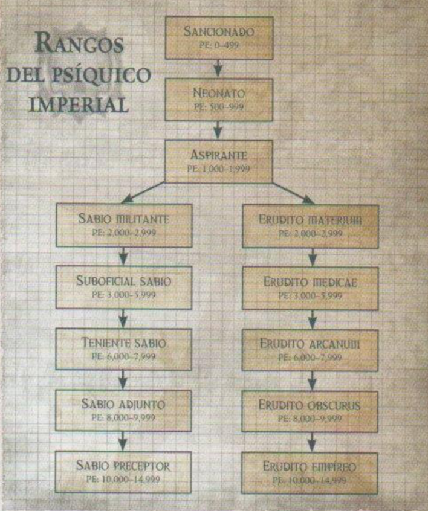
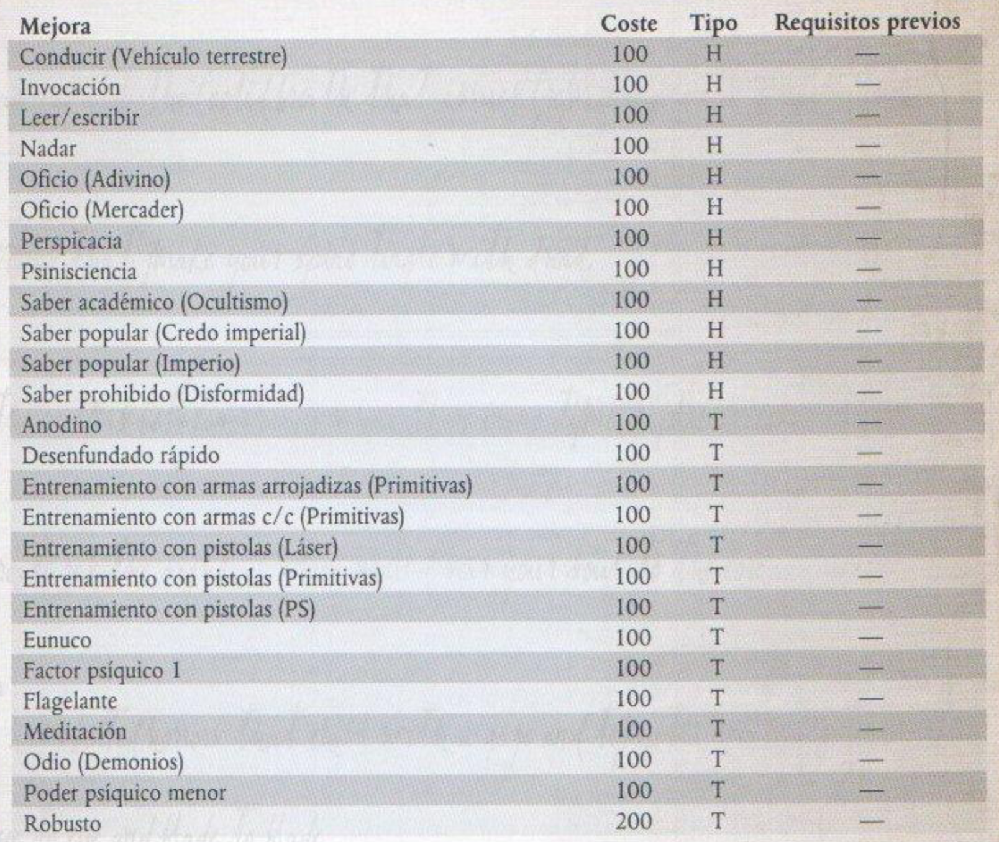

# Características y atributos

## Características

- **33** (HA) Habilidad de Armas
- **32** (HP) Habilidad de Proyectiles
- **31** (F) Fuerza
- **28** (R) Resistencia
- **37** (AG) Agilidad
- **30** (INT) Inteligencia
- **27** (PER) Percepción
- **37** (V) Voluntad (42 +5 +5)
- **40** (EM) Empatía

## Habilidades

- **Hablar idioma** (Gótico vulgar) (INT)
- **Leer/Escribir** (Gótico vulgar) (INT)
- **Hablar idioma** (Colmena) (INT)
- **Leer/Escribir** (Colmena) (INT)
- **Hablar idioma** (Lengua secreta Tecnológica) (INT)
- **Competencia tecnológica** (INT)
- **Oficio copista** (INT)

	
- **asdasdasdasd** (V) (p.123)

		asdasdasdasdasdasdasdasdasdasdasdasdasdasdasdasdasdasdasdasdasdasdasdasdasdasdasdasdasdasdasdasdasdasdasdasd
		asdasdasdasdasdasdasdasdasdasdasdasdasdasdasdasdasdasdasdasd
		asdasdasdasdasdasdasdasdasdasdasdasdasdasdasdasdasdasdasdasd
		asdasdasdasdasdasdasdasdasdasdasdasdasdasdasdasdasdasdasdasdasdasdasdasdasdasdasdasd

	Niveles de éxito|Resultado
	---|---
	Normal|asdasdasdasdasdasdasdasdasdasdasdasdasdasdasdasd
	Uno|asdasdasdasd asdasdasdasdasdasdasdasd    asdasdasdasd
	Dos o más|asdasdasdasdasdasdasdasdasdasdasdasdasdasdasdasdasdasdasdasdasdasdasdasd
	

## Talentos y rasgos

- Entrenamiento con armas c/c (primitivas)
- Entrenamiento con pistolas (láser)
- Factor psíquico 1

		He liberado mi portencial psíquico.
		Elige tantos poderes psíquicos menores como la mitad de mi Bono de Voluntad (redondea hacia arriba) de entre los descritos en el "Capítulo VI: Poderes psíquicos".
		Obtengo un Factor psíquico de 1; puedo tirar 1 dado y sumar mi Bono por Voluntad al resultado para manifestar poderes psíquicos.
		
		Especial: Si mi bono aumenta más adelante, no ganaré poderes adicionales (no tiene efecto retroactivo)
		
- Acostumbrado al vacío
	
		Inmune a las náuseas que suelen provocar los viajes espaciales.
		Los entornos de gravedad cero o baja gravedad no se consideran terreno difícil para mí.
		
- Agorero

		Suscito el desprecio y la desconfianza de la mayoría.
		Soy propenso a atraer toda la atención negativa que genere el grupo de acólitos:
		Acusaciones cuando la leche se agría, mercaderes malhumorados, niños con puñados de heces de grox...
		
		Sufro una penalización de -5 a todas las tiradas de Empatía que tenga que hacer para intactuar con humanos no nacidos en el vacío.
		
- Familiarizado c/naves

		Afinidad natural a las naves.
		
		Orientación (Estelar) (INT) y Pilotar (Nave Espacial) (AG) se consideran habilidades básicas para mi.
		
- Venturoso

		Suerte sobrenatural.
		
		Cada vez que gaste 1 punto de Destino (pero no si lo sacrifico), tiro 1d10.
		Con 9 (natural) no perderé el punto de destino.
		
- Psíquico autorizado

## Otros atributos

- 11 Heridas
- 3 Puntos de destino
- 3 Metros por asalto
- 1 Locura

## Bonos

- Agorero (-5 a todas las tiradas de empatía contra humanos que no sean del vacío)
- Orientación estelar (Int), pilotar nave espacial (Agi) > se considera habilidad básica
- Cada vez que gaste 1 pto de destino (no sacrificando) tira 1-10. Si sacas un 9 natural (sin bonos), no pierdes el punto

## A gastar

- Experiencia total: 423
- Experiencia actual: 73
- Poderes psíquicos menores > La mitad del bono de voluntad redondeando hacia arriba (2)

## Mejoras

- +5 Voluntad (100)
- +5 Voluntad (250)
